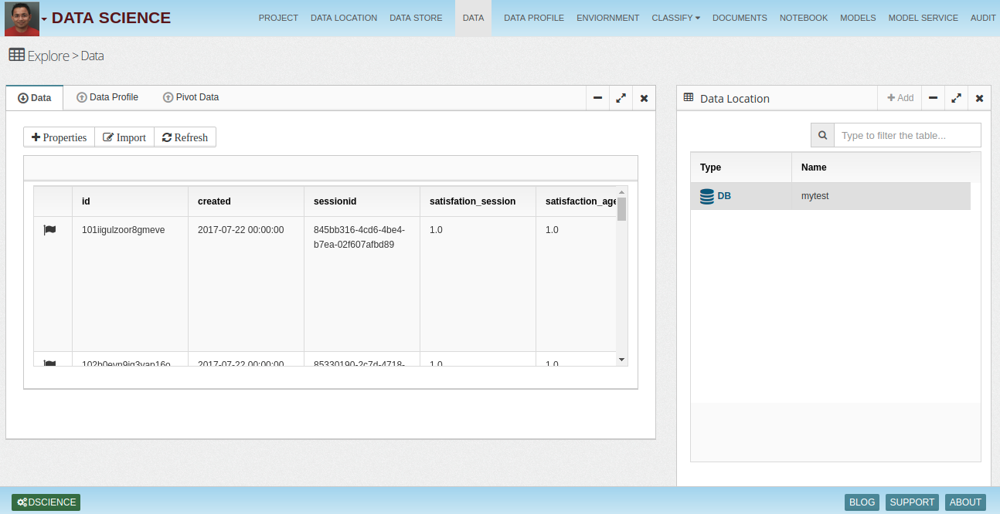
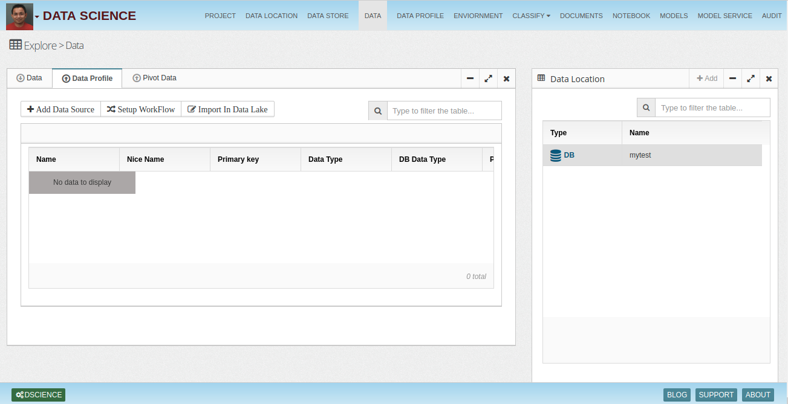
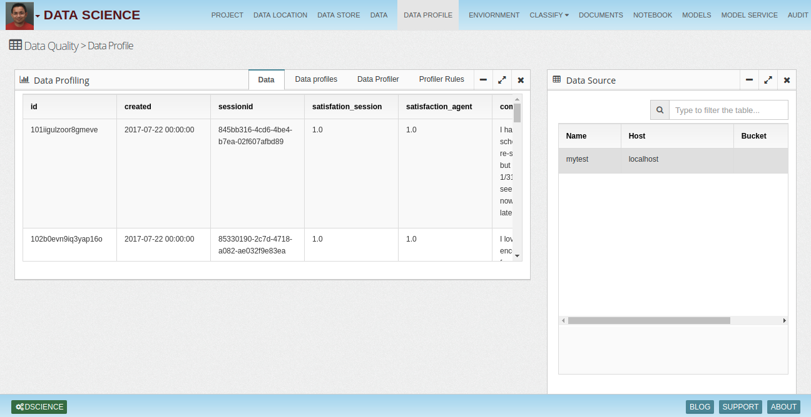
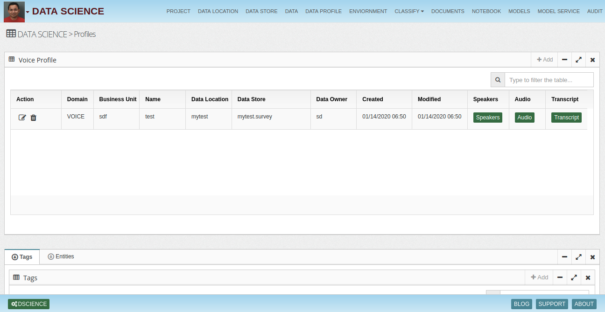
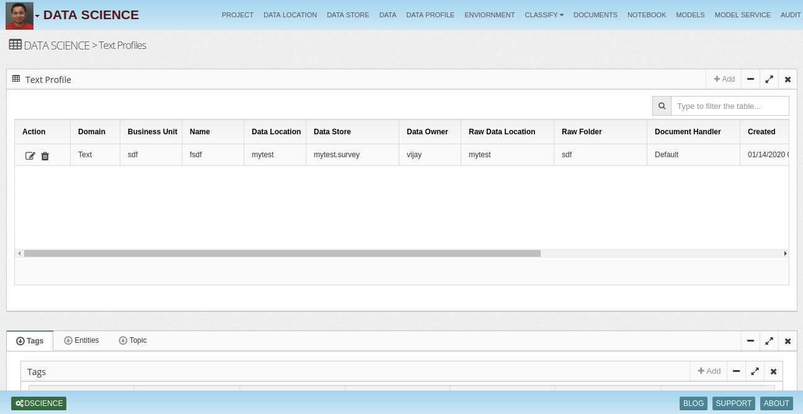
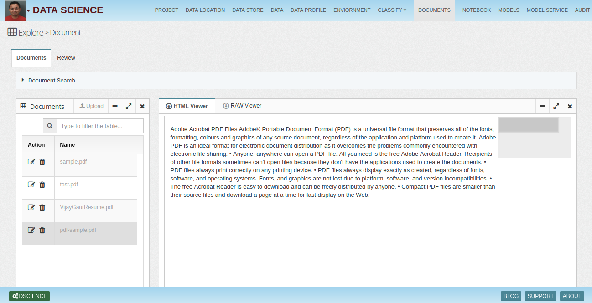
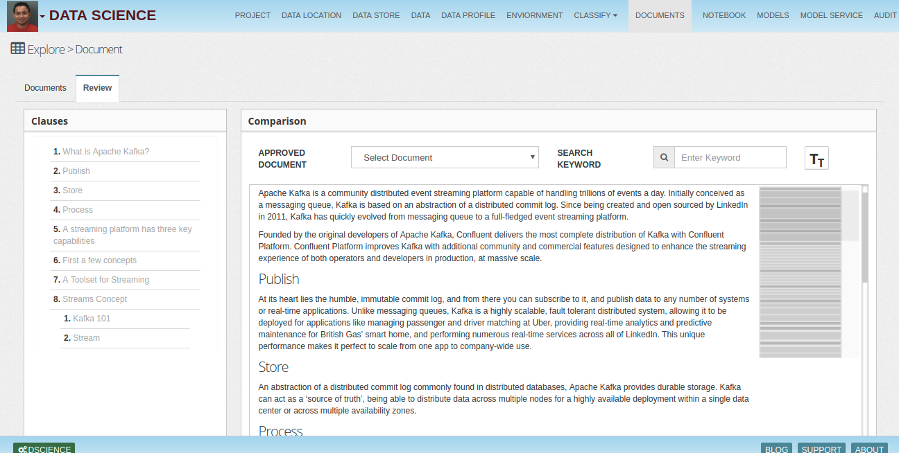
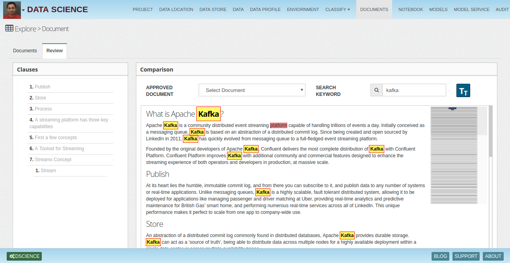

# Data-Science-Workbench
Next Generation Data Science Workbench - AI, Big Data & GPU Cluster

Data science is an exploratory work, where data scientists perform many steps while building models. Few of those steps are:

Ingest data from different sources (Operational data, Market data, Macro economic data, Public data etc..)
Perform statistical analysis of fields
Clean and standardize data sets
Build models (Python, R, Scala, Java...etc)
Train & validate models
Monitor models and perform calibration (Variance analysis)
Work in groups, share drafts and published versions
Once model is ready, obtain approvals from model & data governance teams
Work with data/IT to perform promotion of models from DEV to QA to PROD
Build and run multiple models/algorithms together (Main & experimental models)
Run models on Big Data, GPU cluster (On Premise or Cloud) etc.
Data Science Workbench
Data science workbench is a self service tool/solution, which enables data scientists to perform variety of data tasks choosing their choice of language (R, Python, Scala etc). It allows data scientists, analysts and business users to collaborate together. Few of the features of workbench are:

Managing projects & data science/analyst teams
Data ingestion, transformation and exploration
Model & notebook building and visualization
Compute resource allocation
Monitoring, devops etc
## Data Location

## Data Store

## Data Explorer

 ### Data

### Data Profile

### Pivot Table

## Data Profiles

## Notebook

As you see from model building steps, it is a long exploratory work. Just like a Pharma scientist, who will break down compound building in multiple steps, produce analysis, data scientists will also need to break down exploratory work in steps and produce evidence/analysis to prove hypothesis. We can call this data story building, which can tell us what do we need to do with data to get to the right model output.

To create data stories data scientists rely on notebooks or BI visual tools. Few of the popular notebooks are:

Jupyter
H2O
Zeppelin etc..
InsightLake Data Science Workbench - AI, Big Data & Fast Computing together with Governance
InsightLake data science workbench enables data scientists/analysts to use their choice of language to build complex ML/Simulation data pipelines using hundreds of algorithms.

It provides following features to assist data scientists:

Big Data - Integrated with Hadoop & Spark
Data management - for importing, cleaning and standardizing data sets
Data Explorer - for data analysis & visualization
Notebook - Create data stories using any language
Engines - Language based engines, H2O, TensorFlow
ML/DL Algorithms - Hundreds of algorithms
GPU Computing - OpenCL & CUDA based framework
Security - Data security, Masking and Role based access/sharing
Workbench allows them to import/export their existing notebooks (InsightLake, Jupyter (Conda), H2O, Zeppelin). They can track the model performance over time and migrate models from DEV to QA to PROD very easily.

Data science workbench also integrates with model governance framework allowing regulated industry (Financials, Insurance..) to validate, govern and monitor models.

## Integrated & Flexible Notebook Solution
InsightLake data science workbench provides flexibility and interoperability with other industry popular notebooks like Conda Jupyter, H2O and Zeppelin. Users can import these notebooks seamlessly and export new notebook in given format (with few restrictions).

## Power of AI & Big Data
InsightLake Data Science Workbench enables companies to use power of Hadoop so large amount of data can be used in training and validation instead of small sample set. This increases model precision and outcome.

## Languages/Engines Supported
Markdown - for HTML
Python
R
Scala
SQL
H2O
Java Script - Use InsightLake constructs seamlessly
Many more....
Algorithms
Unsupervised - K-means...
Supervised - Bayes, Random Forest...
Regression - Logistic, MARS..
Dimensionality Reduction - PCA, LDA..
Recommendation/Association Rule Learning - Apriori
Hidden Chains - HMM
Ensemble - GBM..
AI - Perceptron, Hopfield...
Deep Learning - Perceptron, CNN, RNN...
Simulation - Monte Carlo
InsightLake Workbench enables data scientists to perform Monte Carlo simulation. Different types of probability distributions are supported for example:

Normal
Triangular
Uniform

## Model Use Cases
Data science workbench allows users to build models using interactive UI. Users can build different use case driven models, train, validate and monitor their performance. Following are the use cases.

### Segmentation

Users can build segmentation models to segregate input data in different segments/clusters. For example they can build customer segments based on their purchase patterns etc.

### Classification

Users can build classification use cases like identifying a transaction as fraud or not fraud.

### Prediction

Users can build prediction models utilizing varients of time series models. They can predict values, score transactions.

### Voice

Users can build new acoustic or language models or adapt with new data for speech recognition.

### Images

Workbench allows users to classify images and extract text.

### Video

Users can perform video classification and extract relevant information.

### Text

Users can perform text classification, summarization and extract entities.

### Content Extractor

## Document

Documents list & HTML View

RAW Data View

Document Search

Document Review

Text Highligting

## Model Training

## Model Services

## Environment

## GPU Cluster
InsightLake workbench allows data scientists to build and run models on GPU clusters. AWS AMIs could be used to setup a cluster very easily. With the power of GPUs complex multi layer/high compute deep learning models can be effectively run on GPU clusters. Two options are provided:

CUDA - with Caffe & Tensorflow
OpenCL - with Torch

To learn more, check out [http://www.insightlake.com/data-science-workbench.html](http://www.insightlake.com/data-science-workbench.html)

Installation
------
* Download or clone the repository. 
* Run bin/insightlake command.
* Open browser with URL as http://localhost:8080/
* Change configuration in /conf folder to set different ports
* By default H2 database is used, you can change the database details in jdbc.properties file

Installation using docker 
------
* Download or clone the repository. 
* cd /docker
* Run `docker-compose -f docker-compose.yaml up --build`
* Open browser with URL as http://localhost:8080/
* While creating Data Location use below credentials  

        * username : root
        * password : password
        * URL :  jdbc:mysql://mysql:3306/

License
------
InsightLake Data Science Workbench is a commercial product but distributed to be used freely. Please contact contact@insightlake.com for details.

Getting Help
----------

You can get help easily :
Community - Google Groups
Slack Channel
Twitter
Facebook
Email: contact@insightlake.com
